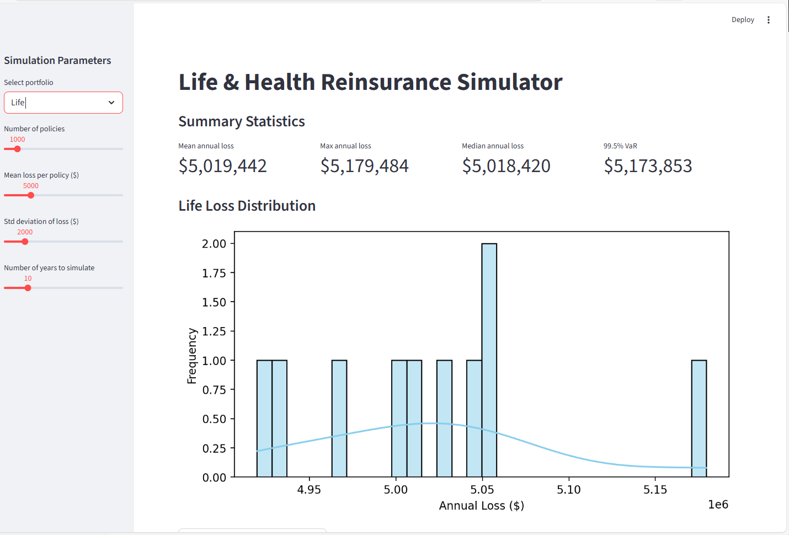
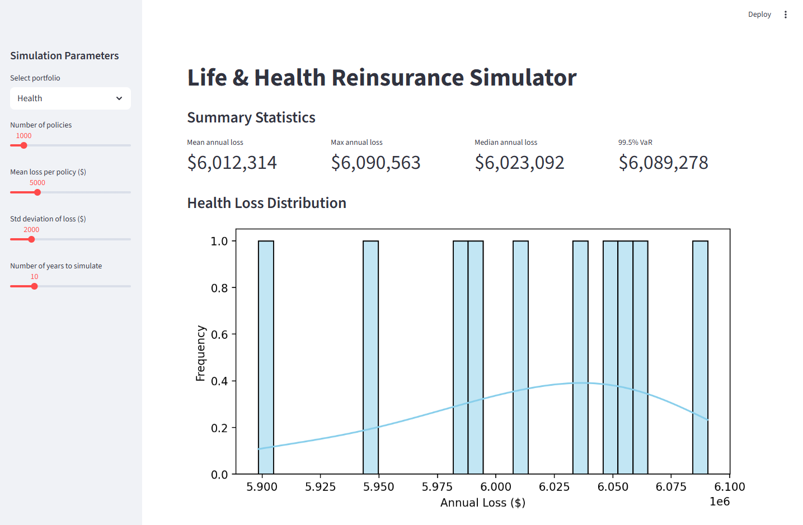
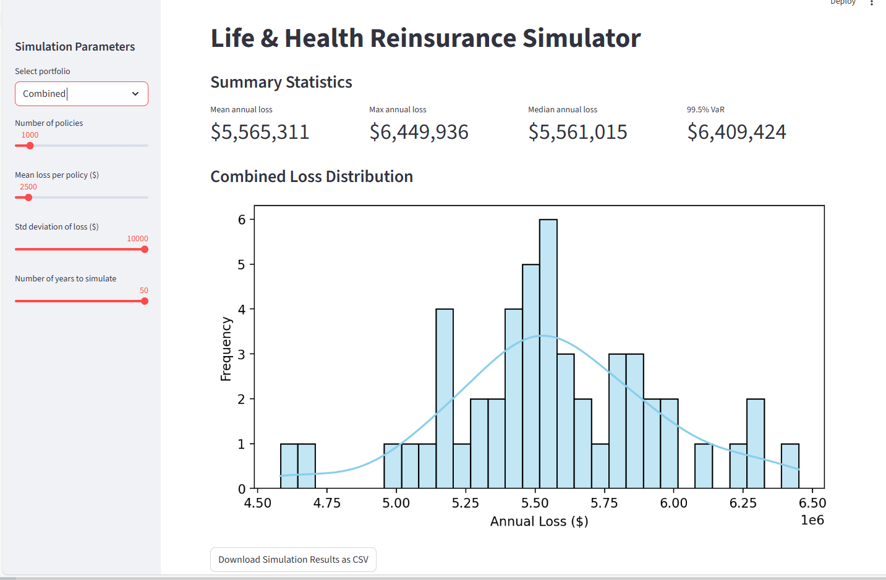

# Life & Health Reinsurance Simulator

## Overview
This project is a **Python-based interactive simulator** for life and health insurance portfolios. It allows users to configure portfolios, run loss simulations, apply reinsurance strategies, and visualize results through **summary statistics and loss distribution charts**. The final step is a **Streamlit dashboard** for interactive exploration and scenario analysis.

---

## Repository Structure

```
life-health-reinsurance-simulator/
├─ app.py                           # Main Streamlit app
├─ modules/
│   ├─ portfolio.py                 # Portfolio simulation logic
│   ├─ visualization.py             # Plotting and visualization functions
├─ notebooks/
│   ├─ 01_portfolio_design.ipynb    # Portfolio setup and initial loss simulation
│   ├─ 02_loss_simulation.ipynb     # Life & Health loss simulation exploration
│   ├─ 03_reinsurance.ipynb         # Reinsurance strategies and calculations
│   ├─ 04_results_analytics.ipynb   # Summary statistics, charts, and analytics
├─ demo_data/                        # Demo screenshots for reference
│   ├─ demo_portfolio_life.png
│   ├─ demo_portfolio_health.png
│   └─ demo_portfolio_combined.png
├─ requirements.txt                  # Python dependencies for the app
└─ README.md
```

---

## 📊 Actuarial Analysis & Insights
This simulator demonstrates core quantitative risk management principles used in the reinsurance industry. By using the parameter sets shown in the demo (1,000 policies, $10,000 Std. Deviation), we can observe:

* **Tail Risk & Solvency II:** The dashboard calculates the **99.5% Value-at-Risk (VaR)**. In the EU, this is the standard proxy for regulatory capital requirements. It represents the "1-in-200-year event"—the amount of capital a company must hold to stay solvent during extreme loss years.
* **The Diversification Benefit:** In the "Combined" portfolio view, you can observe how the total volatility is dampened compared to analyzing Life and Health in silos. This visualizes how a diversified insurance book reduces a firm's overall risk profile.
* **Volatility vs. Stability:** By maximizing the Standard Deviation, the simulator highlights "High Severity" events, which are the primary drivers for purchasing reinsurance treaties to protect a balance sheet.

---

## Notebooks / Analysis
1. **01_portfolio_design.ipynb** – Create and configure life and health insurance portfolios.  
2. **02_loss_simulation.ipynb** – Run loss simulations for the portfolios with different parameters.  
3. **03_reinsurance.ipynb** – Apply reinsurance strategies and analyze financial impacts.  
4. **04_results_analytics.ipynb** – Generate summary statistics, charts, and visual analytics.

---

## Streamlit Dashboard
The `app.py` provides an **interactive dashboard** to explore portfolio scenarios.

### Simulation Parameters
- Portfolio selection: Life, Health, or Combined  
- Number of policies  
- Mean loss per policy ($)  
- Standard deviation of loss ($)  
- Number of years to simulate

### Outputs
- Summary statistics:  
  - Mean annual loss  
  - Maximum annual loss  
  - 99.5% Value-at-Risk (VaR) as a proxy for regulatory capital  
- Life and health loss distribution plots  
- Downloadable results (optional CSV export)

### Demo Screenshots
#### Life Portfolio
  
#### Health Portfolio
  
#### Combined Portfolio


---

## 🚀 Future Outlook & Improvements
This project serves as a foundation for more complex actuarial engines. Planned improvements include:
* **Correlation Modeling:** Implementing Copula-based simulations to model the dependency between different risk types (Life vs. Health).
* **Contractual Structures:** Adding logic for specific reinsurance treaties like **Excess-of-Loss (XoL)** and **Quota Share**.
* **Macro-Economic Factors:** Factoring in medical inflation and interest rate sensitivity for long-term health and life projections.

---

## Tools & Technologies
- **Python** – for simulations and analytics  
- **Pandas, NumPy** – data manipulation and calculations  
- **Matplotlib, Seaborn, Altair** – visualizations  
- **Streamlit** – interactive dashboard  
- **Jupyter Notebooks** – step-by-step exploration

---

## How to Run
1. Clone the repository:  
   ```bash
   git clone https://github.com/saurabh97kum/life-health-reinsurance-simulator
   cd life-health-reinsurance-simulator
   ```
2. Create a virtual environment and install dependencies:  
   ```bash
   python -m venv venv
   venv\Scripts\activate       # Windows
   # source venv/bin/activate  # macOS/Linux
   pip install -r requirements.txt
   ```
3. Run the Streamlit app:  
   ```bash
   streamlit run app.py
   ```
4. Use the sliders and selectors in the app to explore different portfolio scenarios.

---

## Notes
- Demo screenshots are included in `demo_data/`.  
- The notebooks provide a complete **step-by-step guide** for portfolio simulation and analytics.  
- This project is intended as a **self-learning resource** for life and health insurance simulation and dashboard creation.
